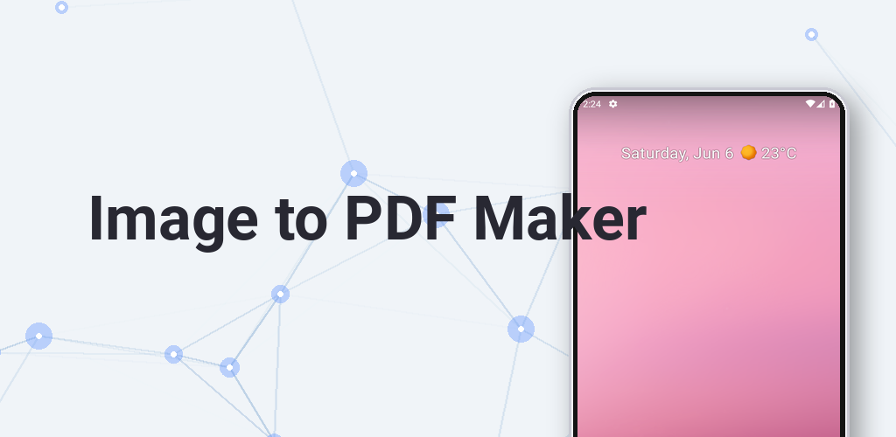
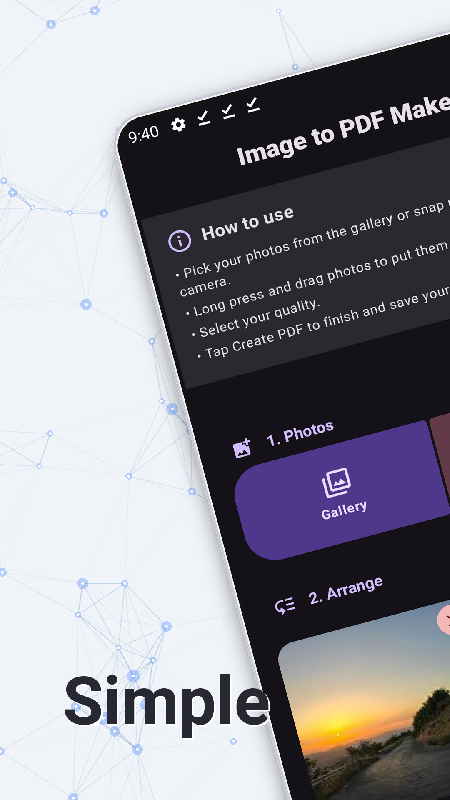
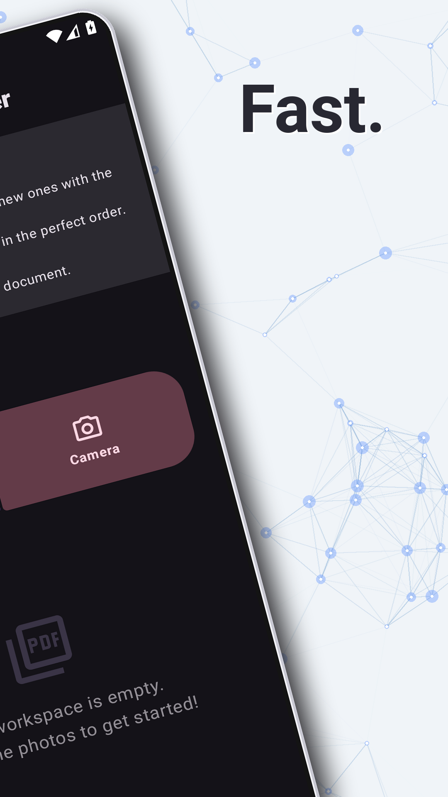
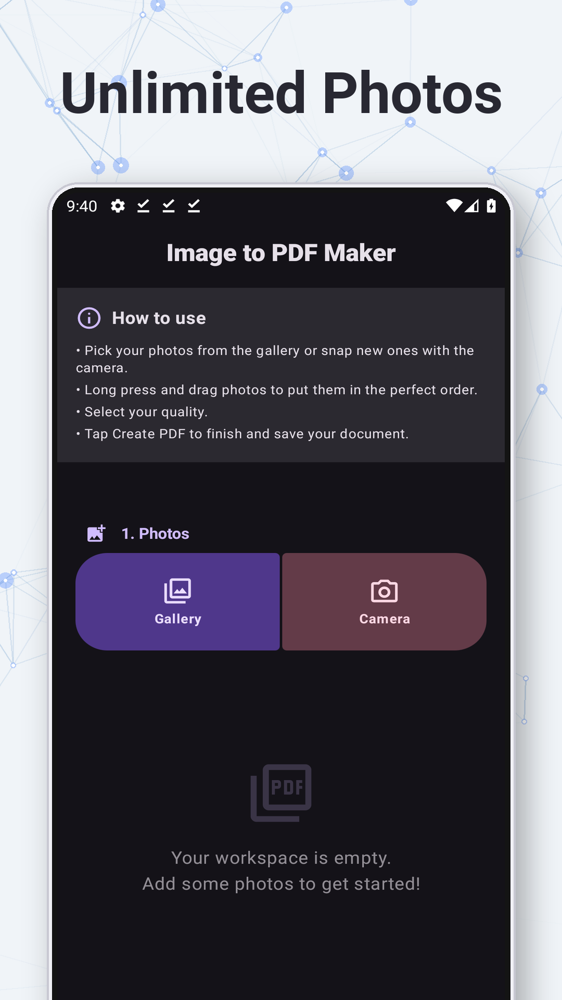
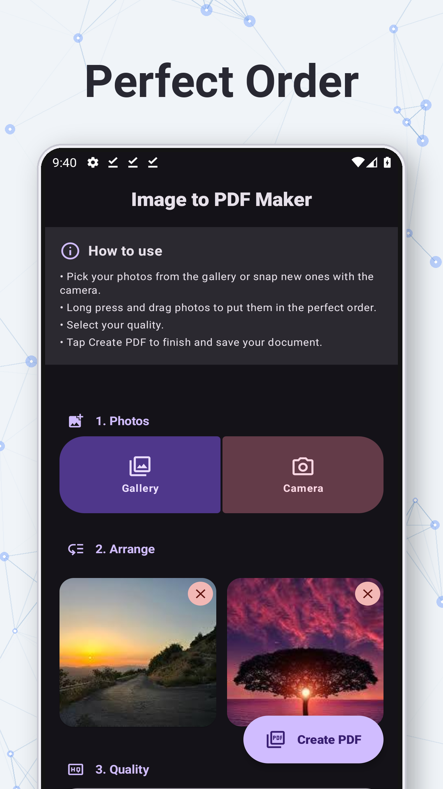
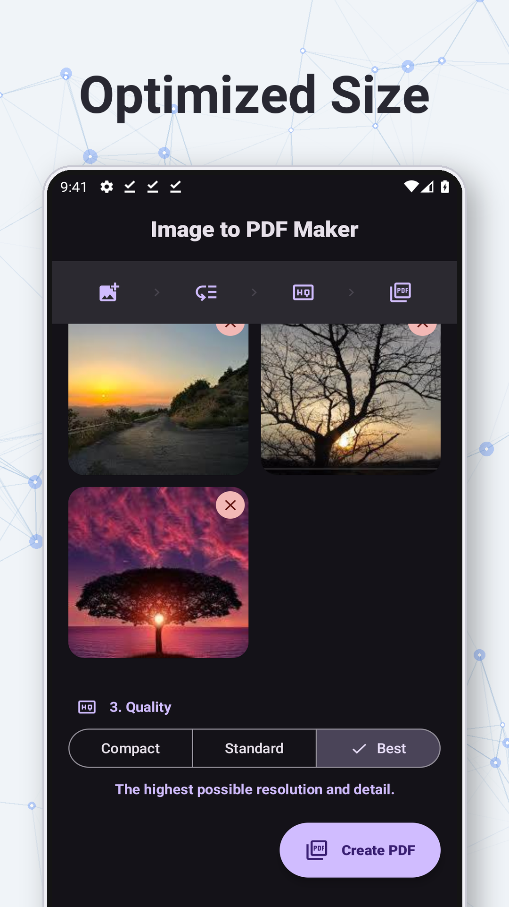
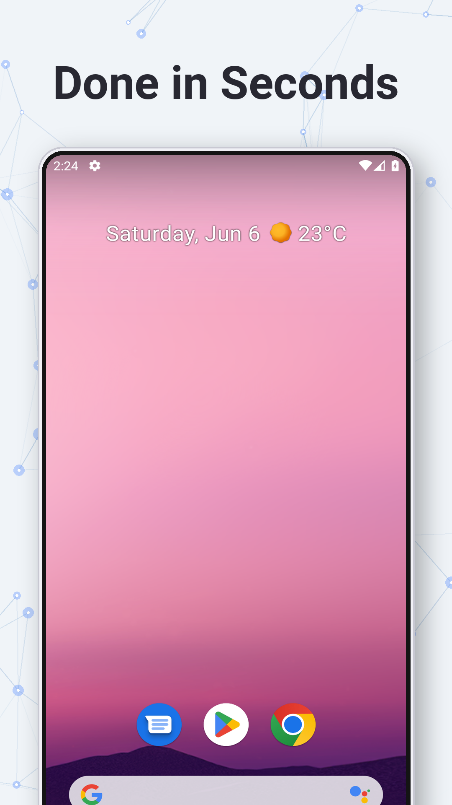

# Image to PDF Maker



Image to PDF Maker is an open-source, privacy-first application designed to convert your photos and images into a single PDF document quickly and securely.

## Features

- **Ad-Free Experience**: No interruptions, just functionality.
- **Privacy-Centric**: Operates entirely offline with no internet permission required. Your data never leaves your device.
- **Camera & Gallery Integration**: Snap new photos directly within the app or select existing ones from your gallery.
- **Intuitive Drag & Drop**: Long-press and drag photos to reorder them exactly how you want.
- **Dynamic Quality Selection**: 
  - **Compact**: Optimized for small file sizes and easy email sharing.
  - **Standard**: Balanced quality for everyday general use.
  - **Best**: Maximum resolution for documents requiring high detail.
- **Quick Preview**: Tap any image to see a full preview before generating the final PDF.
- **Easy Export**: Save the generated PDF directly to your device or share it instantly via your favorite apps.
- **Multi-Language Support**: Fully localized in over 20 languages.
- **Material 3 Design**: A modern, clean interface built with Jetpack Compose that supports Material You dynamic coloring.

## Screenshots

<p align="center">
  
  
  
</p>
<p align="center">
  
  
  
</p>

## Download

Get it on the **Google Play Store**:

<a href="https://play.google.com/store/apps/details?id=com.domedav.pdftoolapp">
  
</a>

Or download the APK directly from the [GitHub Releases](https://github.com/domedav/pdftoolapp/releases).

## Build Instructions

This project uses Gradle. You can build the APK using the following command:

```bash
./gradlew assembleRelease
```

## Technical Details

- **Minimum SDK**: 24 (Android 7.0)
- **Target SDK**: 37 (Android 17)
- **Language**: Kotlin
- **UI Framework**: Jetpack Compose

## License

Copyright 2026 Image to PDF Maker Authors

Licensed under the Apache License, Version 2.0 (the "License");
you may not use this file except in compliance with the License.
You may obtain a copy of the License at

    http://www.apache.org/licenses/LICENSE-2.0

Unless required by applicable law or agreed to in writing, software
distributed under the License is distributed on an "AS IS" BASIS,
WITHOUT WARRANTIES OR CONDITIONS OF ANY KIND, either express or implied.
See the License for the specific language governing permissions and
limitations under the License.
